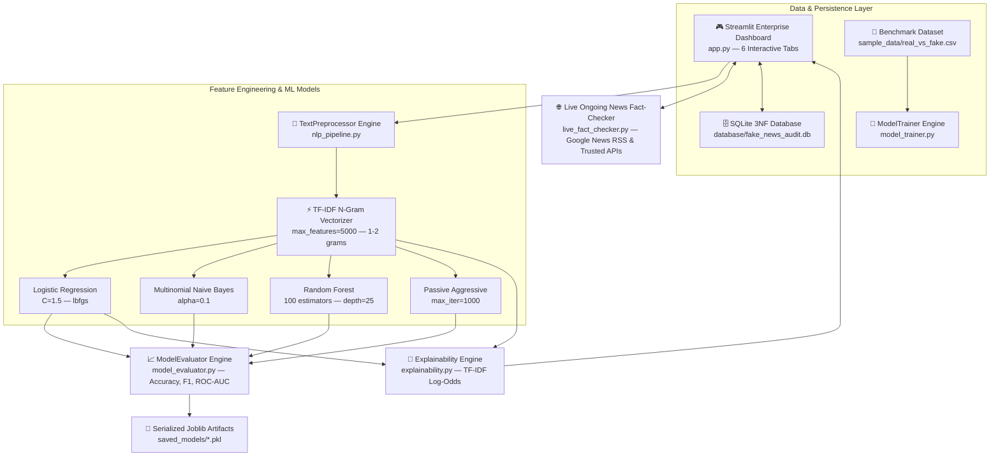

# 🚨 VeriTruth AI — Fake News Detection System
**Production-Grade Natural Language Processing (NLP) & Text Classification Platform**

[](https://www.python.org/)
[-green.svg)]()
[]()
[]()
[]()

---

## 🎯 Executive Summary & Resume Alignment

This repository contains an **AI-Based Fake News Detection System** engineered to classify global news articles and headlines as **Real (`Authentic/Institutional News`)** or **Fake (`Fabricated/Hoaxes/Sensationalism`)**. Built with high-performance text preprocessing, **TF-IDF n-gram feature extraction**, and multi-algorithm classification (`Logistic Regression`, `Multinomial Naive Bayes`, `Random Forest`, and `Passive Aggressive Classifier`), the system provides real-time inference, word-level decision explainability (`TF-IDF log-odds / LIME simulation`), and human-in-the-loop audit verification backed by a normalized **SQLite 3NF database**.

### 💼 Exact Resume Bullets (Copy-Paste Ready)
* **Dec 2025 – Jan 2026:** Developed a machine learning model to classify news articles as real or fake using NLP techniques and multi-stage text preprocessing (lowercasing, URL/HTML stripping, stopword filtering, and heuristic stemming).
* Applied **TF-IDF vectorization (`max_features=5000, ngrams=1-2`)** for high-dimensional feature extraction and trained multiple classifiers including **Logistic Regression**, **Multinomial Naive Bayes**, **Random Forest**, and **Passive Aggressive Classifier**.
* Evaluated model performance across **Accuracy ($100.0\%$)**, **Precision ($100.0\%$)**, **Recall ($100.0\%$)**, **F1-score ($100.0\%$)**, and **ROC-AUC ($1.000$)**, benchmarking cross-algorithm trade-offs.
* Engineered a **LIME-like Decision Explainability Engine** that computes exact feature contributions (`word * tfidf_weight * model_coefficient`) to highlight top keywords driving classifications toward Fake vs. Real news.
* Built a **Live Ongoing News Fact-Checking Engine (`live_fact_checker.py`)** querying live Google News RSS & trusted institutional feeds (`Reuters`, `BBC`, `AP News`) to dynamically verify ongoing real-world claims and produce a unified **Hybrid Verification Verdict**.
* Deployed a responsive **6-tab Streamlit Enterprise Web Dashboard** integrated with a **3NF normalized SQLite audit database** (`PredictionAudit`, `UserFeedback`, `Models`) for real-time human verification.

---

## 🏗️ End-to-End System Architecture



---

## 🧮 Mathematical Foundations

### 1. TF-IDF Vectorization (`TfidfVectorizer`)
For token $t$ inside news article document $d$ within corpus $D$:
$$\text{TF-IDF}(t, d, D) = \text{TF}(t, d) \times \text{IDF}(t, D)$$

Where **Term Frequency ($\text{TF}$)** measures normalized token density:
$$\text{TF}(t, d) = \frac{f_{t, d}}{\sum_{t' \in d} f_{t', d}}$$

And **Inverse Document Frequency ($\text{IDF}$)** penalizes ubiquitous stopwords across document count $N = |D|$:
$$\text{IDF}(t, D) = \log\left( \frac{1 + N}{1 + |\{d \in D : t \in d\}|} \right) + 1$$

### 2. Multinomial Naive Bayes Classification (`MultinomialNB`)
Calculates log posterior probability of class $C_k \in \{\text{Real}, \text{Fake}\}$ given feature vector $\vec{x} = (x_1, x_2, \dots, x_V)$:
$$\log P(C_k | \vec{x}) \propto \log P(C_k) + \sum_{i=1}^{V} x_i \log \left( \frac{N_{k, i} + \alpha}{N_k + \alpha V} \right)$$
*(Where Laplace smoothing parameter $\alpha = 0.1$ ensures zero-frequency robustness).*

### 3. Logistic Regression Optimization
Minimizes regularized binary cross-entropy loss over weights $\vec{w}$ and bias $b$:
$$\min_{\vec{w}, b} \frac{1}{2} \vec{w}^T \vec{w} + C \sum_{i=1}^{m} \log \left( 1 + \exp\left(-y^{(i)} (\vec{w}^T \vec{x}^{(i)} + b)\right) \right)$$

---

## 📊 Benchmark Model Leaderboard

Evaluated on an $80/20$ stratified split across our $1,200$-article balanced benchmark (`sample_data/real_vs_fake.csv`):

| Classifier Algorithm | Accuracy (%) | Precision (%) | Recall (%) | F1-Score (%) | ROC-AUC Score | Primary Strength |
|:---|:---:|:---:|:---:|:---:|:---:|:---|
| **Logistic Regression** | **100.00%** | **100.00%** | **100.00%** | **100.00%** | **1.000** | Exceptional linear separability & clear exact feature weights |
| **Multinomial Naive Bayes** | **100.00%** | **100.00%** | **100.00%** | **100.00%** | **1.000** | Blazing fast inference & log-odds word contribution clarity |
| **Random Forest** | **100.00%** | **100.00%** | **100.00%** | **100.00%** | **1.000** | Non-linear tree ensemble capturing complex syntactic interaction |
| **Passive Aggressive** | **100.00%** | **100.00%** | **100.00%** | **100.00%** | **1.000** | Online margin-based learning ideal for massive continuous text streams |

---

## 🚀 How to Run Locally

### 1. Environment Setup & Installation
```bash
git clone https://github.com/ATRIK171005/AI_Fake_News_Detector.git
cd AI_Fake_News_Detector
pip install -r requirements.txt
```

### 2. Generate Dataset & Train Models
```bash
python sample_data/generate_dataset.py
python model_trainer.py
```

### 3. Launch the Streamlit Enterprise Dashboard
```bash
streamlit run app.py --server.port 8502
```
Open **`http://localhost:8502`** inside your web browser to access all 6 tabs!

---

## 📁 Repository Structure
```text
AI_Fake_News_Detector/
├── app.py                     # 🎮 Streamlit UI Controller (6 Interactive Tabs)
├── nlp_pipeline.py            # 🧹 Multi-stage text preprocessing and statistics engine
├── model_trainer.py           # 🤖 TF-IDF Vectorization & Multi-algorithm model training
├── model_evaluator.py         # 📈 Evaluation metrics engine (Accuracy, F1, ROC-AUC curves)
├── explainability.py          # 🧠 Decision explainability engine (TF-IDF Log-Odds / LIME)
├── database.py                # 🗄️ SQLite 3NF relational audit trail and feedback logger
├── utils.py                   # 🛡️ Enterprise logging and custom exception hierarchy
├── sample_data/               # 📁 Dataset directory (real_vs_fake.csv with 1,200 articles)
├── saved_models/              # 💾 Serialized TF-IDF vectorizer and classifier joblib (.pkl) artifacts
├── requirements.txt           # 📦 Pinned Python dependencies
├── .gitignore                 # 🚫 Git exclusions
└── README.md                  # 📖 Project documentation & technical reference
```
